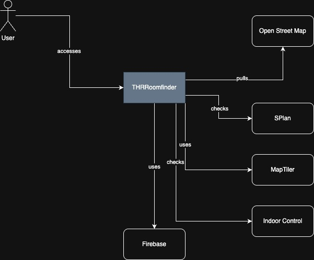
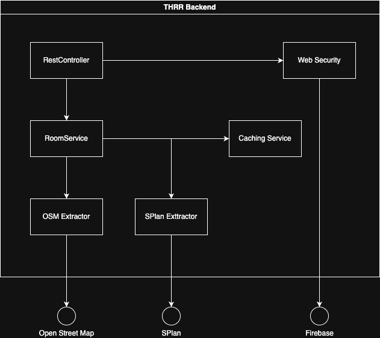
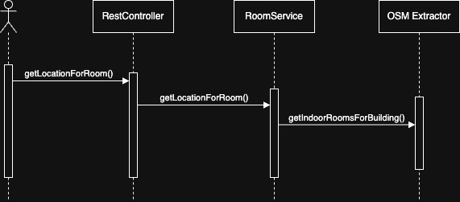

# Introduction and Goals

THRRoomfinder is a web and mobile-friendly application that helps users locate rooms and lecture halls across various university campuses. The target users include students, faculty, and visitors.

## Requirements Overview

## Quality Goals

- Provide fast and intuitive room search functionality.
- Deliver map-based visual guidance to room locations.
- Offer responsive UI for both desktop and mobile users.
- Ensure scalability for additional campus locations.

## Stakeholders

+-------------+---------------------------+---------------------------+
| Role/Name   | Contact                   | Expectations              |
+=============+===========================+===========================+
| *\<Role-1>* | *\<Contact-1>*            | *\<Expectation-1>*        |
+-------------+---------------------------+---------------------------+
| *\<Role-2>* | *\<Contact-2>*            | *\<Expectation-2>*        |
+-------------+---------------------------+---------------------------+

# Architecture Constraints

- Frontend is built with React/Next.js, styled with Mantine UI library, and uses TypeScript.
- Backend is implemented with Kotlin and Spring Boot 3.
- Uses MapLibre for map rendering.
- Indoor data is served from OpenStreetMap
- Requires API keys for MapTiler (Tile Server), Indoor Control (OSM Indoor Data), and Firebase (IDP).
- Delivered as a Docker Compose setup for local development and containers for cloud deployment.

# Context and Scope

## Business Context

| Element         | Description                                                                                                 |
|-----------------|-------------------------------------------------------------------------------------------------------------|
| User            | Students, university staff, campus visitors who uses the room finder to access locations and time schedules |
| Open Street Map | Open Street Map used to fetch current inroom location data if not stored in service                         |
| SPlan           | Stores schedules of Rooms                                                                                   |
| MapTiler        | Used as tiler service for map data                                                                          |
| Indoor Control  | Serves indoor data for the frontend map                                                                     |
| Firebase        | Serves as IDP for the Admin Dashboard                                                                       |

## Technical Context

#### **External Interfaces:**

- **OpenStreetMap API** - for indoor map data.

- **SPlan** - to access room schedule data.

- **MapTiler API** – for map tile rendering.

- **Indoor Control API** – for building/floor data.

- **Firebase** – for identity management in the admin dashboard.

#### **Deployment:**

- Delivered via Docker Compose and runs on a web server (localhost:80 or production domain).

**\<Diagram or Table>**

**\<optionally: Explanation of technical interfaces>**

**\<Mapping Input/Output to Channels>**

# Solution Strategy

- Use **Spring Boot** backend to expose APIs for room search and schedule data.

- Use **Next.js** for server-side rendered React frontend for SEO and performance.

- Separate concerns between map rendering (MapLibre) and business logic.

- Mobile-first responsive design for wide accessibility.

# Building Block View

## Whitebox Overall System

Motivation

:   *\<text explanation>*

Contained Building Blocks

| Building Block | Description                                 |
|----------------|---------------------------------------------|
| THRR Frontend  | User Interface for user access              |
| THRR Backend   | Room location data and schedule information |

Important Interfaces

:   *\<Description of important interfaces>*

### THRR Frontend

Used to provide a user interface for the using including a map showing indoor data.
Further a direct link can be used to show a specific room.
The frontend also provides a admin dashboard to clear schedule cache data and delete room data in the database to trigger a fetch from Open Street Map.

### THRR Backend

Provides room locations and room schedules to be shown by the frontend module.

[//]: # (### Open Street Map)

[//]: # ()
[//]: # (This interface provides Open Street Map node information, thus from indoor room nodes to lat and long coordinates can be fetched.)

[//]: # ()
[//]: # (### SPlan)

[//]: # ()
[//]: # (This interface is used to fetch the room schedule using the specific room name.)

## Level 2

### THRR Backend (Whitebox)

#### Contained Blackboxes:

| Building blackbox | Description                                                          |
|-------------------|----------------------------------------------------------------------|
| RestController    | Entry Point for REST Requests                                        |
| WebSecurity       | Checks specific endpoints for authentication using the Firebase IDP. |
| RoomService       | Room Service is used to handle all room related requests.            |
| OSM Extractor     | Fetches location information for specified room name.                |
| SPlan Extractor   | Fetches schedule for specified room name.                            |

### RoomService

Handles all room related functionalities and performs caching on successful requests.

### OSM Extractor

For a given room name and location, `OSM Extractor` fetches a location searching under a specific node configured for the location. 

### SPlan Extractor

For a given room name and location, `SPlan Extractor` fetches the schedule for the specified room under in the specified location.
The service can fetch the schedule for the current week or the week of the specified date.

# Runtime View

## Fetch Room Location

1. User calls `getLocationForRoom()` on RestController
2. RestController calls `getLocationForRoom()` on RoomService
3. RoomService fetches Room from OSM Extractor via `getIndoorRoomsForBuilding()`

- *\<insert runtime diagram or textual description of the scenario>*

- *\<insert description of the notable aspects of the interactions
  between the building block instances depicted in this diagram.\>*

## \<Runtime Scenario 2> {#__runtime_scenario_2}

## ... {#_}

## \<Runtime Scenario n> {#__runtime_scenario_n}

# Deployment View {#section-deployment-view}

## Infrastructure Level 1 {#_infrastructure_level_1}

***\<Overview Diagram>***

Motivation

:   *\<explanation in text form>*

Quality and/or Performance Features

:   *\<explanation in text form>*

Mapping of Building Blocks to Infrastructure

:   *\<description of the mapping>*

## Infrastructure Level 2 {#_infrastructure_level_2}

### *\<Infrastructure Element 1>* {#__emphasis_infrastructure_element_1_emphasis}

*\<diagram + explanation>*

### *\<Infrastructure Element 2>* {#__emphasis_infrastructure_element_2_emphasis}

*\<diagram + explanation>*

...

### *\<Infrastructure Element n>* {#__emphasis_infrastructure_element_n_emphasis}

*\<diagram + explanation>*

# Cross-cutting Concepts {#section-concepts}

## *\<Concept 1>* {#__emphasis_concept_1_emphasis}

*\<explanation>*

## *\<Concept 2>* {#__emphasis_concept_2_emphasis}

*\<explanation>*

...

## *\<Concept n>* {#__emphasis_concept_n_emphasis}

*\<explanation>*

# Architecture Decisions {#section-design-decisions}

# Quality Requirements {#section-quality-scenarios}

## Quality Tree {#_quality_tree}

## Quality Scenarios {#_quality_scenarios}

# Risks and Technical Debts

- Dependency on external APIs (OpenStreetMap, MapTiler, Indoor Control).

- Data accuracy of indoor maps might vary by location.

- Lack of offline functionality may hinder usability in poor connectivity zones.

# Glossary

| Term               | Definition                                                                                                                                                   |
|--------------------|--------------------------------------------------------------------------------------------------------------------------------------------------------------|
| MapLibre           | Open-source JavaScript map rendering library.                                                                                                                |
| Mantine UI library | A modern React component library that offers a comprehensive set of customizable UI elements and hooks for building responsive web applications efficiently. |
| Open Street Map    | Is a free, open map database updated and maintained by a community of volunteers via open collaboration.                                                     |
