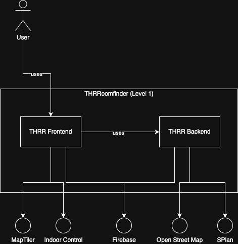

# Introduction and Goals

THRRoomfinder is a web and mobile-friendly application that helps users locate rooms and lecture halls across various university campuses. The target users include students, faculty, and visitors.

## Requirements Overview

## Quality Goals

- Provide fast and intuitive room search functionality.
- Deliver map-based visual guidance to room locations.
- Additionally show schedule information for a selected room.
- Offers a responsive UI for both desktop and mobile users.
- Ensure scalability for additional campus locations.

## Stakeholders

| Role/Name                  | Contact                | Expectations         |
|----------------------------|------------------------|----------------------|
| Konstantin Späth           | duell10111@t-online.de | Developer and User   |
| Felix Rampf (SQS lecturer) | -                      | Quality requirements |

# Architecture Constraints

- Frontend is built with React/Next.js, styled with Mantine UI library, and uses TypeScript.
- Backend is implemented with Kotlin and Spring Boot 3.
- Uses MapLibre for map rendering.
- Indoor data is served from OpenStreetMap
- Requires API keys for MapTiler (Tile Server), Indoor Control (OSM Indoor Data), and Firebase (IDP).
- Delivered as a Docker Compose setup for local development and containers for cloud deployment.

# Context and Scope

## Business Context

| Element         | Description                                                                                                 |
|-----------------|-------------------------------------------------------------------------------------------------------------|
| User            | Students, university staff, campus visitors who use the RoomFinder to access location and schedule information |
| Open Street Map | Open Street Map used to fetch current indoor location data if not stored in service                         |
| SPlan           | Stores schedules of Rooms                                                                                   |
| MapTiler        | Used as tiler service for map data                                                                          |
| Indoor Control  | Serves indoor data for the frontend map                                                                     |
| Firebase        | Serves as IDP for the Admin Dashboard                                                                       |

## Technical Context

#### **External Interfaces:**

- **OpenStreetMap API** - for indoor map data.

- **SPlan** - to access room schedule data.

- **MapTiler API** – for map tile rendering.

- **Indoor Control API** – for building/floor data.

- **Firebase** – for identity management in the admin dashboard.

#### **Deployment:**

- Delivered via Docker Compose and runs on a web server (localhost:80 or production domain).

# Solution Strategy

- Use **Spring Boot** backend to expose APIs for room search and schedule data.

- Use **Next.js** for server-side rendered React frontend for SEO and performance.

- Separate concerns between map rendering (MapLibre) and business logic.

- Mobile-first responsive design for wide accessibility.

# Building Block View

## Whitebox Overall System

Motivation

:   The overall architecture follows a layered, modular design to promote separation of concerns and scalability. Each block represents a logical or technical unit that handles a specific responsibility, enabling clearer ownership and easier maintenance.

Contained Building Blocks

| Building Block | Description                                 |
|----------------|---------------------------------------------|
| THRR Frontend  | User Interface for user access              |
| THRR Backend   | Room location data and schedule information |

Important Interfaces

:   RESTful APIs form the primary communication mechanism between the frontend and backend. These APIs expose endpoints for room location lookup, schedule retrieval, and administrative functions (e.g., clearing cache, deleting entries). Authentication is enforced on administrative endpoints via Firebase IDP.

### THRR Frontend

Provides the user interface, including a map showing indoor data.
Further a direct link can be used to show a specific room.
The frontend also provides an admin dashboard to clear schedule cache data and delete room data in the database to trigger a fetch from Open Street Map.

### THRR Backend

Provides room locations and room schedules to be shown by the frontend module.

## Level 2

### THRR Backend (Whitebox)

#### Contained Blackboxes:

| Building blackbox | Description                                                          |
|-------------------|----------------------------------------------------------------------|
| RestController    | Entry Point for REST Requests                                        |
| WebSecurity       | Checks specific endpoints for authentication using the Firebase IDP. |
| RoomService       | Room Service is used to handle all room related requests.            |
| OSM Extractor     | Fetches location information for specified room name.                |
| SPlan Extractor   | Fetches schedule for specified room name.                            |

### RoomService

Handles all room related functionalities and performs caching on successful requests.

### OSM Extractor

For a given room name and location, `OSM Extractor` fetches a location by searching within a predefined node configuration for the location. 

### SPlan Extractor

For a given room name and location, `SPlan Extractor` fetches the schedule for the specified room in the specified location.
The service can fetch the schedule for the current week or the week of the specified date.

# Runtime View

## Fetch Room Location

1. User calls `getLocationForRoom()` on RestController.

2. RestController calls `getLocationForRoom()` on RoomService.

3. RoomService fetches Room from OSM Extractor via `getIndoorRoomsForBuilding()`.
   
   Further, the result is cached on successful responses.

## Fetch Room Schedule

1. User calls `getScheduleForRoom()` on RestController.

2. RestController calls `getRoomScheduleForRoom()` on RoomService.

3. RoomService fetches Room from StarPlanService via `getScheduleForRoom()`.
   
   Further, the result is cached on successful responses.

## Fetch Available Rooms

1. User calls `getRooms()` on RestController.

2. RestController calls `getAllRooms()` on RoomService.

3. RoomService fetches Rooms from RoomRepository via `findAll()`.
   
   Further, the result is cached on successful responses.

# Deployment View

## Infrastructure

Motivation

:   The frontend and backend services reside in separate containers.
The separate containers allow the app to be scaled independently.

Quality and/or Performance Features

:   The application is optimized for fast user interaction by minimizing latency through caching (StarPlan and RoomRepository queries). 
Performance is further enhanced by container-based deployment, allowing backend and frontend services to scale independently. Use of MapLibre ensures smooth map rendering.

Mapping of Building Blocks to Infrastructure

- THRR Frontend → Docker container running Next.js served via NGINX or equivalent reverse proxy.
- THRR Backend → Spring Boot service container with API endpoints and database integration.
- Database → PostgreSQL with PostGIS extension for spatial data support.
- External services (OSM, SPlan, Firebase, MapTiler) are accessed via HTTPS.

# Cross-cutting Concepts

## Authentication and Authorization

Firebase Authentication is integrated into the admin dashboard. Backend endpoints requiring admin-level privileges are secured using Firebase ID tokens verified via Spring Security.

## Caching Strategy

Spring Cache abstraction (with Caffeine) is used to cache StarPlan and Room responses. RoomService caches available rooms and schedules, with optional manual invalidation via the admin dashboard.

## API Design

Follows REST principles. Each endpoint is well-documented and exposes clear resource-based routes (e.g., `/api/room/{name}`, `/api/schedule/{room}`).

## Reactive Request Processing

The backend uses a nonblocking mechanism to process the requests, which improves availability by preventing thread blocking caused by slow external services.

# Architecture Decisions

### **Architecture Decision Record (ADR): Use of OSM Indoor Data Instead of a Custom Map Database**

**Status:** Accepted

**Date:** 2025-04-15

**Deciders:** Konstantin Späth

**Component:** RoomFinder Backend – Location Data Integration

#### **1. Context and Problem Statement**

The RoomFinder system requires indoor location data to accurately place rooms on a digital map. Two options were considered:

1. Build and maintain a custom indoor map database.

2. Utilize indoor data from OpenStreetMap (OSM), particularly via Overpass API queries.

The system must be able to:

- Determine spatial room positions (latitude/longitude),

- Support building-specific geometries,

- Be kept reasonably up-to-date with minimal maintenance.

#### **2. Considered Options**

1. **Use OSM indoor data** (via Overpass API)

2. **Develop and manage a custom indoor map database**

#### **3. Decision Outcome**

**Chosen Alternative:** Use OSM indoor data

- ✅ Leverages crowd-sourced data that already exists for many public buildings.

- ✅ No need to build and maintain our own data collection and update infrastructure.

- ✅ Enables rapid bootstrapping of building and room geometries.

- ⚠️ Indoor data coverage on OSM can be inconsistent or outdated depending on the location.

- ⚠️ Parsing and extracting reliable data requires additional logic and validation.

#### **4. Pros and Cons of the Options**

| **Option**               | **Pros**                                                                                                              | **Cons**                                                                                                               |
|--------------------------|-----------------------------------------------------------------------------------------------------------------------|------------------------------------------------------------------------------------------------------------------------|
| **OSM indoor data**      | - Freely available - Easily accessible via Overpass API - Updated by global community- Scales well            | - Coverage varies by region - Data schema may be inconsistent - Requires parsing logic for nodes and relations |
| **Custom indoor map DB** | - Full control over structure - Can ensure data completeness and precision - Optimized for app-specific needs | - High initial development cost - Needs a data entry and update process - Potentially redundant with OSM       |

#### **5. Links**

- [OpenStreetMap Indoor Mapping](https://wiki.openstreetmap.org/wiki/Indoor_Mapping)

- [Overpass API](https://wiki.openstreetmap.org/wiki/Overpass_API)

- Implementation: OSMExtractorService.kt 

### **Architecture Decision Record (ADR): Caching StarPlan Responses to Reduce External Load**

**Status:** Accepted

**Date:** 2025-04-31

**Deciders:** Konstantin Späth

**Component:** RoomFinder Backend – StarPlan Integration

#### **1. Context and Problem Statement**

The RoomFinder backend integrates with the external **StarPlan** system to fetch room schedules and availability information. StarPlan is an external service not under our control, and it:

- Can become a bottleneck if queried too frequently,

- May impose rate limits or throttling,

- Increases latency due to network overhead and response size.

Our users expect fast and reliable access to room schedules. To meet this requirement while avoiding excessive load on StarPlan, we need an efficient solution to reduce the number of outgoing requests.

#### **2. Considered Options**

1. **Introduce a caching mechanism for StarPlan responses**

2. **Query StarPlan live on every request**

3. **Pre-fetch and persist StarPlan data periodically in our own database**

#### **3. Decision Outcome**

**Chosen Alternative:** Cache StarPlan responses in memory (or via a managed cache)

- ✅ Significantly reduces redundant API calls to StarPlan

- ✅ Improves backend response time for repeated queries

- ✅ Transparent to consumers of the API

- ⚠️ Requires cache invalidation strategy (e.g., TTL or manual clearing)

- ⚠️ Risk of serving slightly outdated data depending on cache lifespan

#### **4. Pros and Cons of the Options**

| **Option**                   | **Pros**                                                                                                        | **Cons**                                                                                 |
|------------------------------|-----------------------------------------------------------------------------------------------------------------|------------------------------------------------------------------------------------------|
| **Cache StarPlan responses** | - Reduces external requests - Fast access to recent data - Easy to implement with Spring Cache/Caffeine | - Needs TTL or eviction strategy - May serve stale data                              |
| **Query StarPlan live**      | - Always fresh data - No cache complexity                                                                   | - Slow responses - High dependency on external service - Potential rate limiting |
| **Persist StarPlan data**    | - Full control over availability - Can aggregate historical data                                            | - Requires storage, sync mechanism - Potentially complex for real-time updates       |

#### **5. Links**

- Implementation class: StarPlanService.kt

- Related utilities: getEntry(), putEntry(), getAllKeysPresent()

- [Spring Cache docs](https://docs.spring.io/spring-framework/reference/integration/cache.html)

# Quality Requirements

## Quality Scenarios

| Quality Attribute | Scenario Description                                                                                     |
|-------------------|----------------------------------------------------------------------------------------------------------|
| Performance       | A student queries a room’s schedule at peak time; the result is returned within 500ms using cached data. |
| Availability      | Even if the external SPlan service is unavailable, previously cached room schedules are still served.    |
| Usability         | A new student accesses the mobile version and finds the room immediately via map and text search.        |
| Maintainability   | A developer updates the caching logic with minimal side effects due to modular service architecture.     |
| Scalability       | A new campus location is added with no need for frontend changes due to flexible backend design.         |
| Security          | An admin clears cached entries; the request is validated via Firebase authentication token.              |

# Risks and Technical Debts

- Dependency on external APIs (OpenStreetMap, MapTiler, Indoor Control).

- Data accuracy of indoor maps might vary by location.

- Lack of offline functionality may hinder usability in poor connectivity zones.

# Glossary

| Term               | Definition                                                                                                                                                   |
|--------------------|--------------------------------------------------------------------------------------------------------------------------------------------------------------|
| MapLibre           | Open-source JavaScript map rendering library.                                                                                                                |
| Mantine UI library | A modern React component library that offers a comprehensive set of customizable UI elements and hooks for building responsive web applications efficiently. |
| Open Street Map    | Is a free, open map database updated and maintained by a community of volunteers via open collaboration.                                                     |
