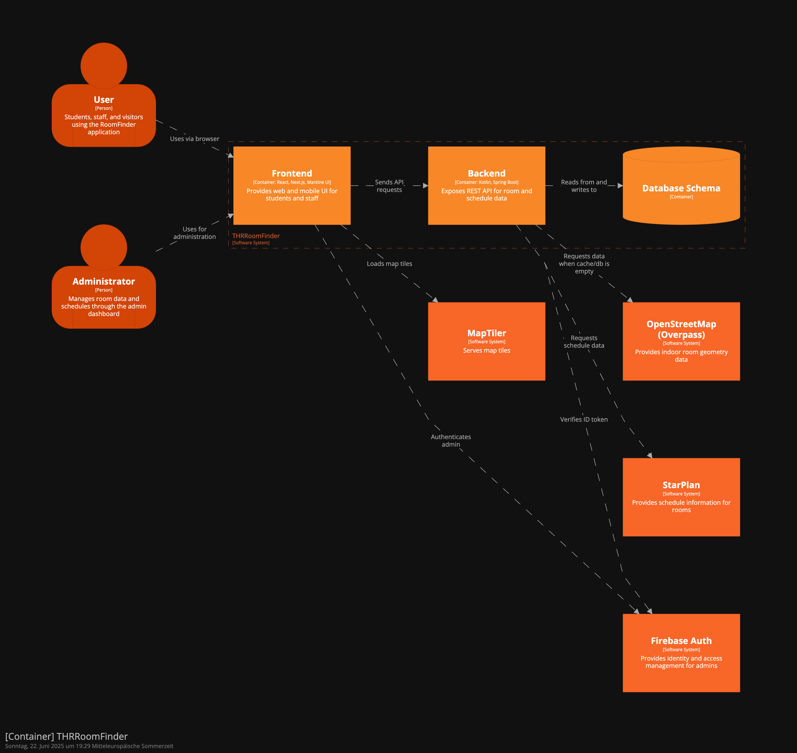

# C4 Model

The C4 model is created using Structurizr and stored in the _c4_ folder.
The Structurizr DSL file can be found at:  `c4/workspace.dsl` 

Below are the images generated by Structurizr on 2025-06-23:

#### System View:

#### Container View

#### Frontend Component View:

#### Backend Component View:

